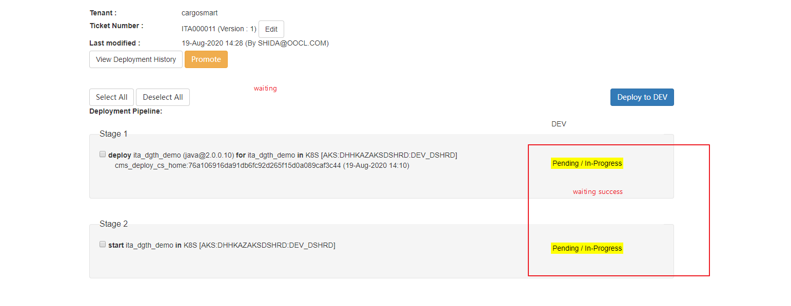

# ita_dgth_demo

# Step to launch
* First of all,change git branch to cms_deploy_cs_home

   ` git checkout cms_deploy_cs_home`
*  open IDEA, and switch the Maven `settings.xml` to `cms-settings.xml`:
  
* "Maven Project" Click "Add" to add the `pom.xml`, then reimport.
  
* Then run `Application.java`

# How to use Lombok
1. Firstly, add maven dependency and reimport:
   ```
   <dependency>
       <groupId>org.projectlombok</groupId>
       <artifactId>lombok</artifactId>
       <version>1.16.22</version>
       <scope>provided</scope>
   </dependency>
   ```
2. Enable IDEA Lombok plugin:
   
3. If you can't download the plugin, please go to the [Lombok github](https://github.com/mplushnikov/lombok-intellij-plugin/releases) to download the latest release zip, then apply it.
   

 

> **Notice**
>
> ​	lombok-plugin version should be compatible with your idea version

​	

### jenkins url
[jenkins link,click me](http://hkgcvpd00539.oocl.com:8080/view/ITA/)
### cms url ,you can deploy here 
[cms link,click me](https://cms.devops.cargosmart.online/public/oneClickDeploy.html?project=ITA)



### Kiali url,you can check log here
[kiali link,click me](https://kiali-tools.shrd.dh2.cargosmart.online/kiali/console/namespaces/ita-dev-dshrd/workloads/ita-dgth-demo-20200819004645248-deployment?tab=logs)

user/password:kiali/kiali_AKS_P@ssw0rd

### amsr subscription 
[AESR,click me](https://csbc-aesr-ui-dev2.shrd.cargosmart.online/#/O2A/appSubscription)
   

### biz api
[BIZ API link ,click me](https://csbc-hm-biz-api-dev2-dshrd.shrd.cargosmart.online/swagger-ui/index.html#/documents-bookingRequest/post_documents_bookingRequest_)


shipper organization ID:4d20c718-e072-4097-a65e-45cfac045361-ita03

OOCL carrier organization:

bizapi role: Shipper/Carrier

application ID:cc21795e-2e88-4b95-825f-5cb306f36a31

AESM DA return Queue:CS/SHRD/HOME/4d20c718-e072-4097-a65e-45cfac045361-ita03/APP/ITA-DGTH-03/EVT/DA
 